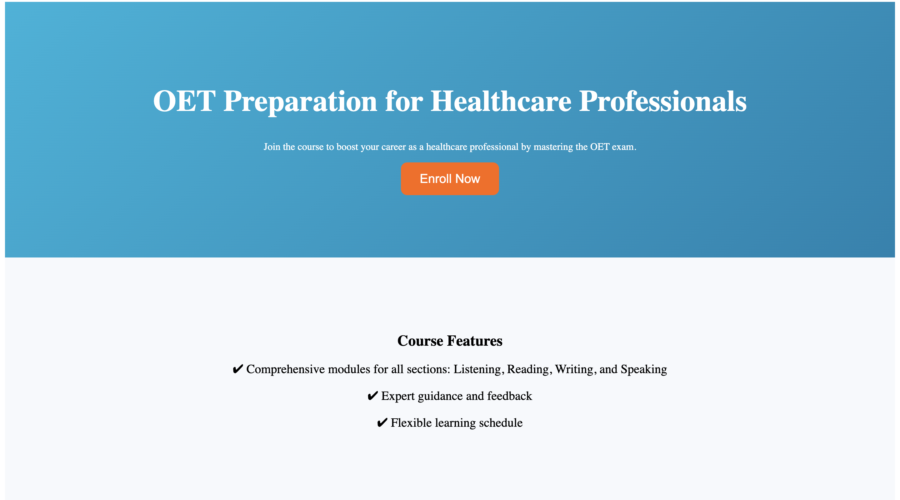

# Pro Medical English

## Pro Medical English site made using HTML, CSS, JavaScript, React, Framer Motion, Styled Components, AOS.

### [Pro Medical English](https://pro-medical-english.netlify.app/)

## Design and Development

### Project Overview

Develop a responsive landing page for the "**OET Preparation for Healthcare Professionals**" course on **www.promedicalenglish.com**, focusing on user engagement and alignment with the site's branding.

---

### Design Choices

#### 1. Structure

- **Header**: Bold title and a clear call-to-action (CTA).
- **Course Features**: Concise details on key benefits.
- **Timeline**: Horizontal layout for course structure.
- **Testimonials**: Social proof with visual contrast.
- **FAQ**: Expandable section for easy access.

#### 2. Brand Consistency

Utilized matching colors and typography for a professional look.

#### 3. User Experience (UX)

- **Strategic CTAs**: Prominent CTAs for engagement.
- **Usability**: Interactive elements for a smooth journey.
- **Responsive Design**: Seamless experience across devices.

---

### Development Choices

#### 1. Technologies

- **React**: For modular and maintainable code.
- **Styled Components**: For scalable and flexible styling.

#### 2. Responsive Design

- **Flexbox and Grid**: Organized layout for scalability.
- **Media Queries**: Adaptable typography for various devices.

#### 3. Integration

- **Modular Design**: Easy integration into the existing CMS.
- **Compatibility**: Standard web technologies used.
